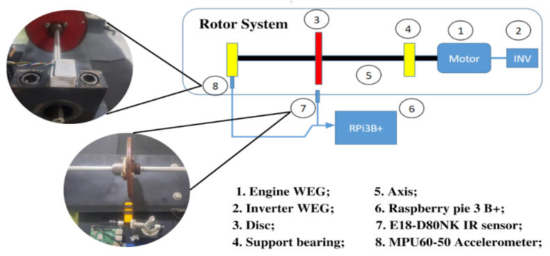
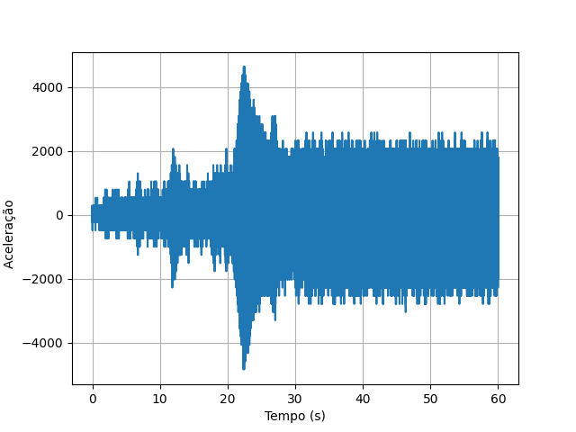
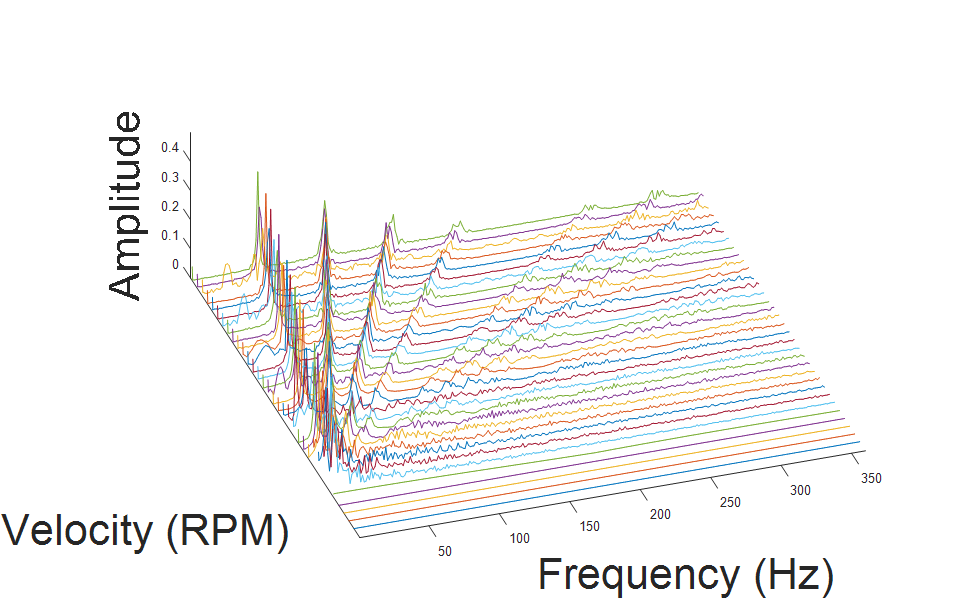
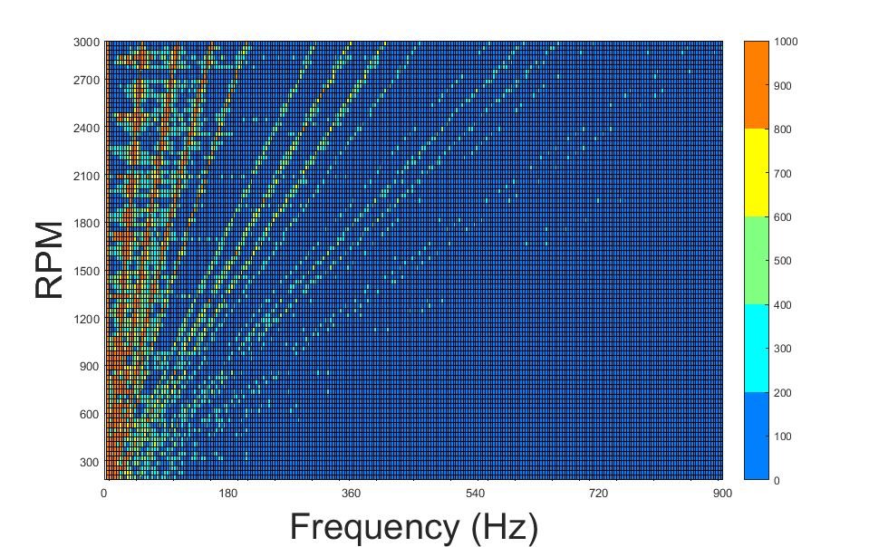

<html> 
    <body> 
        <h1>Orders for an electric motor</h1> 
	<h2>Data were collected with the Modular Analyzer (LVI-UFCG) developed at LVI (Vibration and Instrumentation Laboratory).</h2>

<h2> Créditos:  
<ul>
    <li>Sávio Mateus Ferreira Pessoa - savio.pessoa@ufcg.edu.br</li>
    <li>Dr. Richard Senko(Research advisor for the development of the Modular Analyzer) - richard.senko@ufcg.edu.br</li>
    <li>Dr. Antonio Almeida(LVI coordinator)</li>
    </ul> </h2>
    
    <h2>An algorithm was desired that was capable of tracing the work orders of an engine obtained through the vibration signals.</h2>
    
    <h2 align = "center">Figure 1 - Setup of the experiment.   
        

            
        

    </h2>
    
    <h2> The vibration signal was collected during a runup from 0 to 3000rpm, the collection lasted 60s. </h2>
        
    <h2 align = "center">Figure 2 - Collected signal.
        

            
        

    </h2>
    
    <h2>Initially this signal is divided into equal parts, for the example 50 divisions were used. 

The FFT (Fast Fuoriier Transform) of each division is calculated. 

The FFT's are plotted sequentially in a single figure. </h2>
    
    <h2 align = "center">Figure 3 - Divisions FFT.
        

            
        

    </h2>
    
	<h2>Finally, the graph in figure 3 shows the engine's work orders, with the first order being the most energetic.</h2>
		
	 <h2 align = "center">Figure 4 - Color spectrogram chart.
        

            
        

    </h2>	
	
	<h2>For the application of the algorithm to be possible, it is necessary to have the sampling frequency of the collected signal or the total collection time.</h2>
	
	<h2>Experiment and algorithm by José Sávyo Soares Lira - josesavyo.lira@ee.ufcg.edu.br
	
	<h2 align="center">Social Contacts</h2>
        

        
         
        
</h2>
		
	</h2>	
	
    </body> 
</html>

